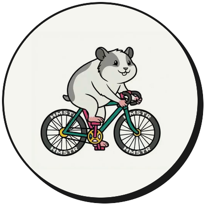

<div align="center">



# BETTER.FTP

### Your power doesn't need a subscription.

Connect your smart trainer, pick a protocol, ride until you can't. That's it. No account needed, no subscriptions, no data harvesting. Just you, your legs, and a number.

**[betterftp.cc](https://betterftp.cc)** · [Android APK (beta)](https://github.com/niecore/betterftp/releases/latest/download/app-release.apk)

</div>

---

## What is it?

BetterFTP is a free iOS and Android app that calculates your **Functional Threshold Power (FTP)** using a guided test on your smart trainer.

It connects directly to your trainer over Bluetooth (FTMS protocol), controls the resistance automatically, and gives you your FTP the moment you stop pedaling — all without creating an account or handing over your data.

✓ **Free** — no subscription, no hidden tiers  
✗ **No ads** — ever  
🔒 **No account** — nothing leaves your device  
⚡ **Simple setup** — Bluetooth, tap, ride

---

## How it works

### 1. Pair & Select
Open the app, scan for your trainer over Bluetooth. Wahoo Kickr, Zwift Hub, Tacx Neo — anything with FTMS support works. Pick your test protocol and you're ready.

### 2. Ride the Test
Warm up, then give it everything you have. Live data — watts, heart rate, cadence — keep you focused throughout the effort.

### 3. See your FTP
The app calculates your FTP instantly when you finish. Full test summary: max HR, avg watts, duration, stage reached.

### 4. Export .FIT
Save the workout as a `.fit` file and send it wherever you like — email it to your coach, import it into Garmin Connect, Strava, TrainingPeaks, or just keep it locally.

---

## Downloads

| Platform | Link |
|---|---|
| iOS | Coming to the App Store |
| Android | [Download APK (beta)](https://github.com/niecore/betterftp/releases/latest/download/app-release.apk) |

---

## Privacy

No analytics. No tracking. No accounts. Workout data stays on your device. The app communicates only with your trainer over Bluetooth — no internet connection required to run a test.

---

## Contributing

Issues and pull requests are welcome. The project is structured as a standard Flutter monorepo:

```
betterftp/   Flutter app (iOS + Android)
website/     Static landing page → betterftp.cc
design/      Design system, color schema, click dummy
```

**Stack:** Flutter · Riverpod · go_router · Hive · fl_chart · flutter_blue_plus · FTMS

```bash
cd betterftp && flutter run
```

---

<div align="center">

© 2026 betterftp.cc by Nico Müller · [hello@betterftp.cc](mailto:hello@betterftp.cc)

</div>
